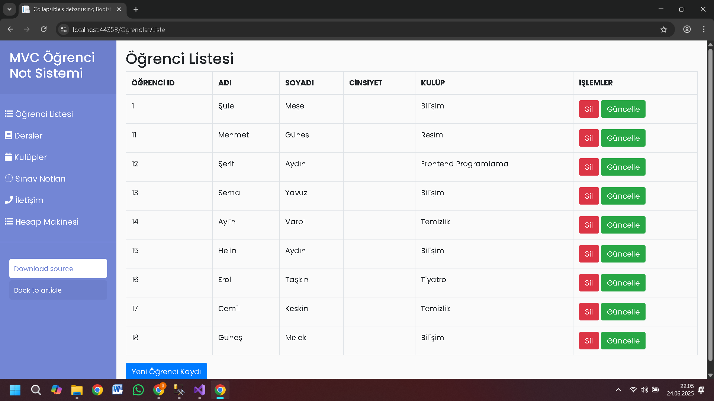
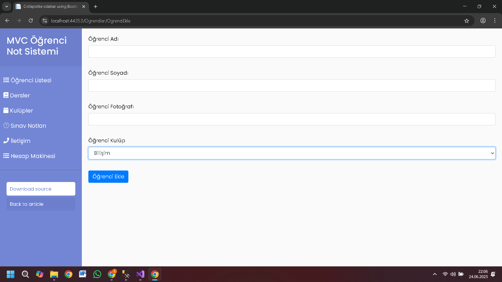
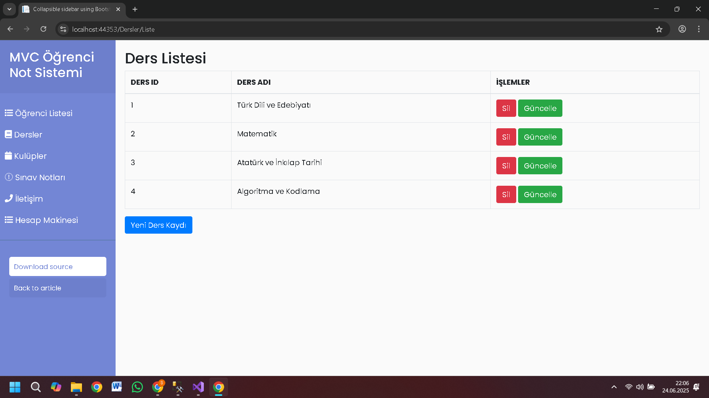
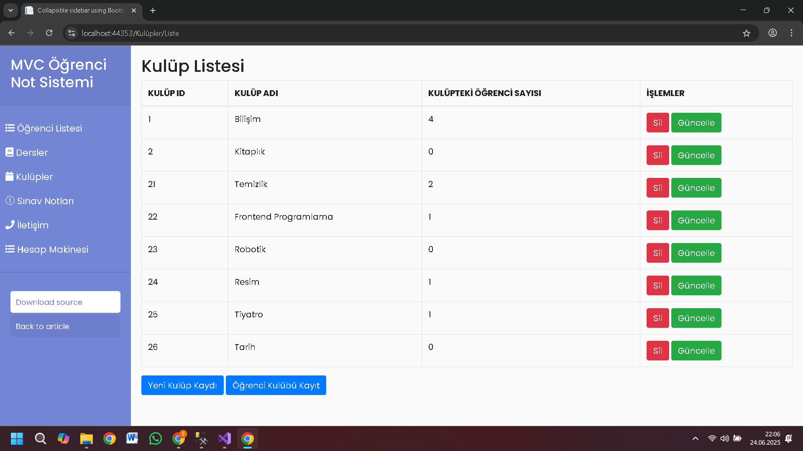
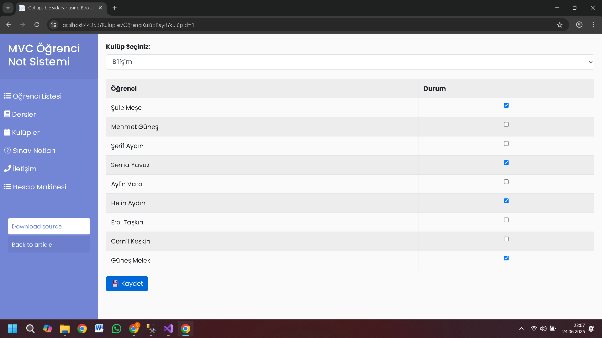
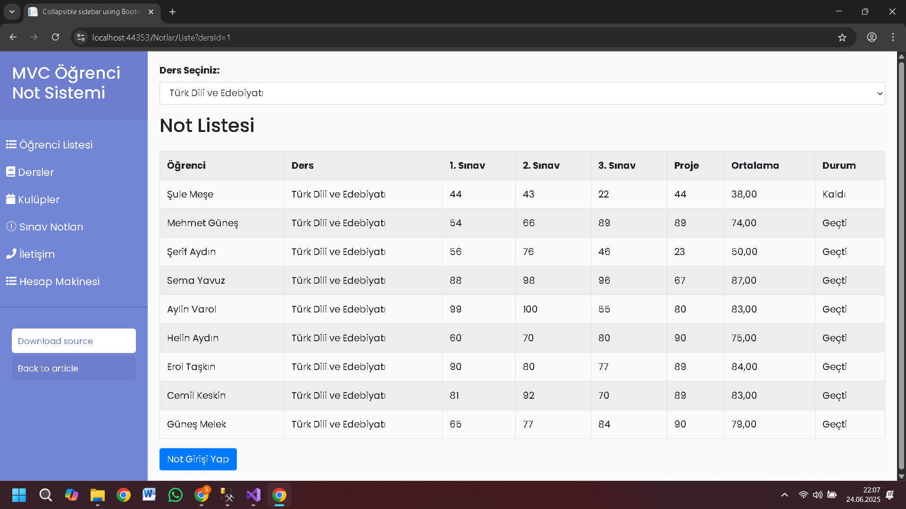
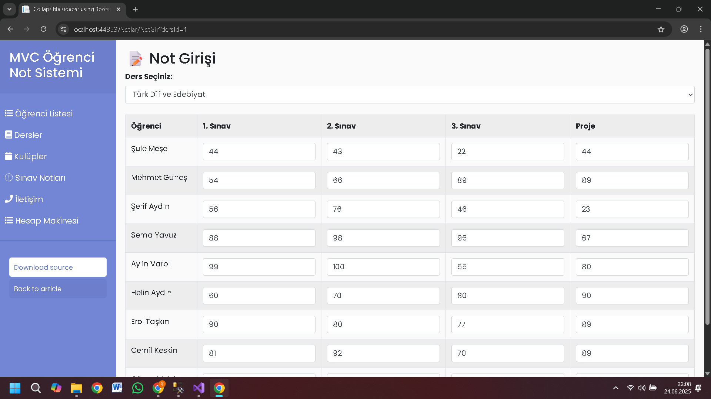
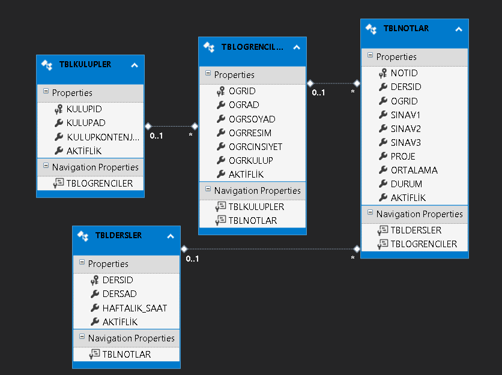

# 📘 E-Okul ASP.NET MVC Projesi

Bu proje, okul yönetim sistemine benzer şekilde ASP.NET MVC ve Entity Framework kullanılarak geliştirilmiştir. Sistem üzerinden dersler, öğrenciler, kulüpler ve notlar yönetilebilmektedir.

## 🚀 Kullanılan Teknolojiler

- ASP.NET MVC 5
- Entity Framework
- Microsoft SQL Server
- Bootstrap 4
- Razor View Engine
- C#
- 
## 📚 Öğrenilen Konular
- MVC mimarisiyle katmanlı mimari uygulama
- Entity Framework ile Database First veri modeli
- LINQ ile veri sorgulama
- Soft Delete ile veri kaybı engelleme
- Razor ile dinamik sayfa oluşturma

## 📂 Modüller ve Özellikler

### 🎓 Dersler
- Listeleme
- Yeni ders ekleme
- Güncelleme
- Soft delete (Aktif/Pasif)

### 👩‍🎓 Öğrenciler
- Listeleme
- Yeni öğrenci ekleme
- Güncelleme
- Soft delete

### 🏫 Kulüpler
- Kulüp listeleme, güncelleme, silme
- Seçilen kulübe çoklu öğrenci atama

### 📝 Notlar
- Derse göre filtreleme
- Öğrencilerin sınav notlarını listeleme
- Ortalama ve geçme/kalma durumunu gösterme
- Toplu sınav notu girişi (dersi alan tüm öğrenciler için)

## 🛡 Soft Delete Yöntemi
Silme işlemlerinde veriler kalıcı olarak silinmez, `Aktif` kolonuyla kontrol edilir. Böylece veri kaybı engellenmiş olur.


## ⚙️ Planlanan Geliştirmeler
- [ ] Giriş Paneli (Admin & Öğrenci Girişi)
- [ ] Öğrenciye özel panel
- [ ] Data Annotation ve form validation
- [ ] Kullanıcı dostu hata mesajları

## 📸 Ekran Görüntüleri

# Öğrenci Listesi


# Yeni Öğrenci Ekleme İşlevi


# Ders Listesi


# Kulüp Listesi


# Kulübe Toplu Öğrenci Atama 


# Not Listesi


# Öğrencilere Toplu Not Girişi 


# Model.edmx


## 📌 Kurulum

1. Projeyi klonlayın:
```bash
git clone https://github.com/kullaniciadiniz/e-okul-mvc.git
2.Visual Studio ile açın.

S3.QL Server üzerinde veritabanını oluşturun. (İstersen Code First kullanabilir veya .bak dosyası paylaşabilirsin.)

4.Web.config içindeki connection string’i güncelleyin.

5.Projeyi çalıştırın.
